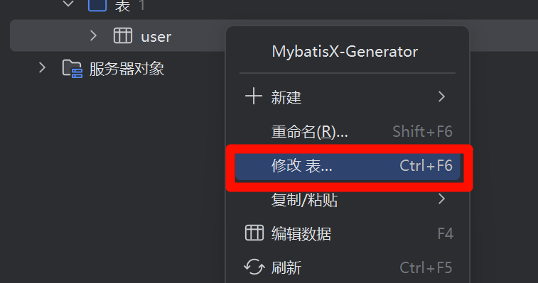
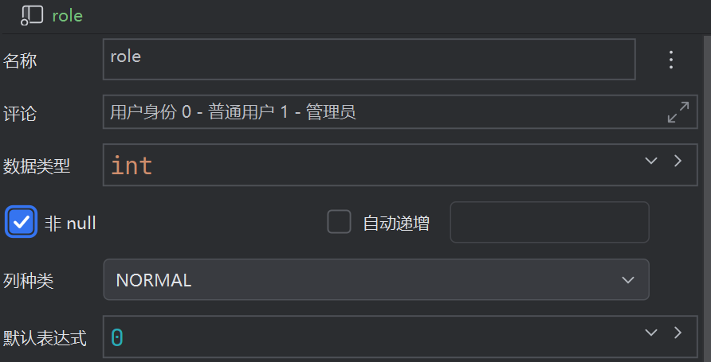

# userCenter

## 企业做项目流程

需求分析 => 设计（概要设计、详细设计）=> 技术选型 => 初始化 / 引入需要的技术 => 写 Demo => 写代码（实现业务逻辑）=> 测试（单元测试）=> 代码提交 / 代码审核 => 部署 => 发布

## 需求分析

1. 登录 / 注册
2. 用户校验（仅管理员可见）对用户的查询或者修改
3. 用户校验（仅付费用户）

## 技术选型

**前端：** 三件套 + React + 组件库 Ant Design + Umi + Ant Design Pro

**后端：**

* Java
* Spring（依赖注入框架，管理 Java 对象，集成一些其他的内容）
* SpringMVC（web 框架，提供接口访问，restful 接口等能力）
* Mybatis（Java 操作数据库的框架，持久层框架，对 jdbc 的封装）
* Mybatis-plus（对 Mybatis 的增强，不用写 sql 也能实现增删改查）
* SpringBoot（**快速启动** / 集成项目，不用自己管理 spring 配置、整合框架）
* Junit（单元测试）
* Mysql（数据库） 

**部署：** 服务器 / 容器（平台）

## 前端初始化

**Ant Design Pro 框架引入**

官网：https://pro.ant.design/zh-CN/

GitHub 项目地址：https://github.com/ant-design/ant-design-pro?tab=readme-ov-file

**操作步骤：**

1. 点击官网 “开始使用” 找到 “初始化” 依次执行。此处的官方文档会持续更新，如果想使用 umi@3 版本可以参照在 “用户中心问题答疑” 区域的问题 1.2 解决。

   

2. 打开终端，执行语句。

   ```shell
   npm i @ant-design/pro-cli -g
   ```

3. 接着执行语句。

   ```shell
   pro create myapp
   ```

   这里的 `myapp` 是新创建文件夹的名字，可以根据实际需求更改。

   

   这里选择 `simple` 创建一个简单的脚手架就可以。

4. 然后就可以使用 WebStorm 打开项目，打开后右下角会弹出 Install dependences 的弹窗，可以直接在这里点击 `npm install` 安装依赖，也可以打开终端，执行 `yarn` 安装依赖。

5. 依赖安装完成后在 package.json 中执行 `start` 启动项目，在终端看到 `ready`，说明项目启动成功，然后在浏览器访问本地的 `8000` 端口。

   

6. umi UI 在后期用不到，所以这里跳过配置 umi UI 的部分

7. 框架更新后创建出来的目录结构会不一样，全部保留也不会影响项目运行，所以这里就跳过瘦身的步骤。

## 后端初始化

三种 Java 项目初始化方法：

1. GitHub搜现成的代码。（不推荐，可能有 “屎山”）
2. SpringBoot官方的模板生成器。（https://start.spring.io/)
3. 直接在 IDEA 开发工具中生成。（最推荐）

### 搭建 SpringBoot 项目

1. IDEA 启动！

2. 通过 Maven 新建一个 SpringBoot 项目。

   

3. 选择依赖，这里需要选择：

   1. Spring Boot DevTools【热更新，更改代码后自动重启项目】
   2. Lombok【Java 注解工具，自动生成 Get、Set】
   3.  Spring Configuration Processor【写配置文件的时候可以自动补全】
   4. MySQL Driver【MySQL 驱动】
   5. Spring Web【给 Java 项目增加 Web 访问能力】
   6.  MyBatis Framework【MyBatis 框架】

   

4. 点击 “创建”，自动生成代码。

### 连接数据库

如果电脑上没有安装过 MySQL 需要先安装 MySQL。

1. 单击 IDEA 右侧的数据库图标，弹出数据库对话框。

2. 单击 “新建” -> “数据源” -> “MySQL”。

   

3. 在弹出的 “数据源和驱动程序” 对话框 “常规” 选项卡中设置数据库。

   

4. 单击 “测试链接” 按钮，当显示 “已成功” 后，说明可以连接上数据库，单击 “确定” 按钮。

   

### 框架整合

按照官网文档操作。https://baomidou.com/getting-started/

**操作步骤：**

1. 在数据库上右击，选择 “新建” -> “架构”，弹出 “创建” 对话框。

   

2. 输入名称 `userCenter`（可以根据实际需求更改），单击 “确定”。

3. 在创建的 `console` 中，执行官方文档中的 sql 语句。

   ```sql
   DROP TABLE IF EXISTS `user`;
   
   CREATE TABLE `user`
   (
       id BIGINT NOT NULL COMMENT '主键ID',
       name VARCHAR(30) NULL DEFAULT NULL COMMENT '姓名',
       age INT NULL DEFAULT NULL COMMENT '年龄',
       email VARCHAR(50) NULL DEFAULT NULL COMMENT '邮箱',
       PRIMARY KEY (id)
   );
   
   -- 如果是新创建的表就不用执行这条 delete 语句
   DELETE FROM `user`;
   
   INSERT INTO `user` (id, name, age, email) VALUES
   (1, 'Jone', 18, 'test1@baomidou.com'),
   (2, 'Jack', 20, 'test2@baomidou.com'),
   (3, 'Tom', 28, 'test3@baomidou.com'),
   (4, 'Sandy', 21, 'test4@baomidou.com'),
   (5, 'Billie', 24, 'test5@baomidou.com');
   ```

4. 在 `pox.xml` 中引入依赖，然后重新加载。这里同时添加下 Junit 的依赖，方便后续使用。

   Junit 的依赖可以从 maven 的中心仓库找到。https://mvnrepository.com/

   

   点进去找到一个用的人多且没有风险点的版本，直接复制文本 内容粘贴在 pom 文件中就可以。

   ```xml
   <dependency>
       <groupId>com.baomidou</groupId>
       <artifactId>mybatis-plus-boot-starter</artifactId>
       <version>3.5.12</version>
   </dependency>
   
   <!-- https://mvnrepository.com/artifact/junit/junit -->
   <dependency>
       <groupId>junit</groupId>
       <artifactId>junit</artifactId>
       <version>4.13.1</version>
       <scope>test</scope>
   </dependency>
   ```

5. 将 `application.properties` 文件的后缀改为 `yml`，在文件中配置信息。

   1. 指定项目名。
   2. 显式指定一下启动的端口号。
   3. 从官方文档中复制相关配置并粘贴进配置文件，更改其配置信息。

   ```yml
   spring:
     application:
       name: userCenter
     datasource:
       driver-class-name: com.mysql.jdbc.Driver
       url: jdbc:mysql://localhost:3306/数据库名
       username: 你的用户名
       password: 你的密码
   server:
     port: 8080
   ```

6.  新建 Mapper 文件夹，然后在启动类中添加注解，注解中的包名改成自己的。

   ```java
   @MapperScan("com.baomidou.mybatisplus.samples.quickstart.mapper")
   ```

   

7. 新建 model 目录，在目录下编写 User 实体类。（直接从官方文档复制）

   ```java
   @Data
   @TableName("`user`")
   public class User {
       private Long id;
       private String name;
       private Integer age;
       private String email;
   }
   ```

8. 编写 Mapper 接口类。（直接从官方文档复制）

   ```java
   public interface UserMapper extends BaseMapper<User> {
   
   }
   ```

9. 编写测试类。（直接从官方文档复制）

   ```java
   @SpringBootTest
   public class SampleTest {
   
       @Autowired
       private UserMapper userMapper;
   
       @Test
       public void testSelect() {
           System.out.println(("----- selectAll method test ------"));
           List<User> userList = userMapper.selectList(null);
           Assert.isTrue(5 == userList.size(), ""); // 这里的断言可以更改为 Junit 的断言
         // Assert.assertEquals(5 == userList.size(), "");
           userList.forEach(System.out::println);
       }
   
   }
   ```

   这里 `userMapper` 如果报错的话，尝试将 `Autowired` 改为 `Resource`。

   `Resource` 会优先按照 JavaBean 的名称注入，如果是 `Autowired` 的话就只会按照类型注入，所以通常使用 `Resource` 来自动注入。

10.  然后直接运行单元测试查看结果。如果这里报错的话是因为 Junit 是 4 版本的，这个 Test 注解不会直接和 SpringBoot 有关联 ，所以需要通过 RunWith 指定一下它运行时基于某个环境，所以可以添加 `@RunWith(SpringRunner.class)` 注解。

## 数据库设计

* 什么是数据库？ —— 存数据的
* 数据库里有什么？ —— 数据表
* Java 操作数据库，代替人工。
* 什么是设计数据库表？ —— 给一个需求场景，根据该场景思考下面的问题
  * 有哪些表？
  * 表中有哪些字段？
  * 字段的类型？
  * 数据库字段添加索引？
  * 表与表之间的关联？

> 性别字段是否需要添加索引？
>
> 不需要，区分度不高的字段。只有两种取值的字段，建了索引也不一定会有用，只会白白增加索引维护的额外开销，因为索引也是需要存储的，所以插入和更新的写入操作，同时需要插入和更新这个字段的索引。所以，唯一性太差的字段不需要创建索引。

| 字段         | 表示含义                 | 数据类型             |                                   |
| ------------ | ------------------------ | -------------------- | --------------------------------- |
| id           | 主键                     | bigint               | 自增、主键                        |
| username     | 昵称                     | varchar              | 256                               |
| useraccount  | 登录账号                 | varchar              | 256                               |
| avatarUrl    | 头像                     | varchar              | 1024                              |
| gender       | 性别                     | tinyint              |                                   |
| userPassword | 密码                     | varchar              | 512、非空                         |
| phone        | 电话                     | varchar              | 128                               |
| email        | 邮箱                     | varchar              | 128                               |
| userStatus   | 用户状态                 | int 0 1              | 默认值 0、非空                    |
| createTime   | 创建时间（数据插入时间） | datetime / timestamp | 默认值 CURRENT_TIMESTAMP          |
| updateTime   | 更新时间（数据更新时间） | datetime / timestamp | 默认值 CURRENT_TIMESTAMP、非空    |
| isDelete     | 是否删除 0 1（逻辑删除） | tinyint              | 默认值 0、非空                    |
| userRole     | 用户角色                 | int                  | 默认值 0（普通用户），1（管理员） |
| planetCode   | 星球用户                 | varchar              | 512                               |

**操作步骤：**

1. 在 IDEA 中单击右侧数据库图标，打开 “数据库” 窗口。

2. 在架构（数据库）上右击，选择 “新建” -> “查询控制台”，打开一个新的控制台。

3. 执行 SQL 删除原来测试 MyBatis-plus 时创建的 user 表。

   ```sql
   drop table user;
   ```

4. 在架构（数据库）上右击，选择 “新建” -> “表”，打开 “新建” 对话框。

5. 在对话框中设置数据表的字段及其属性信息。

6. 设置完成后单击 “确定” 按钮。

或者可以直接在控制台执行 SQL 创建数据表。

```sql
create table user
(
    id           bigint auto_increment comment '主键'
        primary key,
    username     varchar(256)                       null comment '昵称',
    userAccount  varchar(256)                       null comment '登录账号',
    avatarUrl    varchar(1024)                      null comment '头像',
    gender       tinyint                            null comment '性别',
    userPassword varchar(512)                       not null comment '密码',
    phone        varchar(128)                       null comment '电话',
    email        varchar(512)                       null comment '邮箱',
    userStatus   int      default 0                 null comment '用户状态',
    createTime   datetime default CURRENT_TIMESTAMP null comment '创建时间',
    updateTime   datetime default CURRENT_TIMESTAMP not null comment '更新时间',
    isDelete     tinyint  default 0                 not null comment '是否删除'
)
    comment '用户';
```

## 注册 - 后端

在实现业务逻辑之前先规整一下整个项目的目录，参考 SpringBoot 项目的目录结构，新建 controller、service、utils 目录。

原先测试 MyBatis-plus 时的 SampleTest、user、userMapper 也可以直接删掉。

接下来使用 MyBatisX 自动生成 user 的实体类，如果没有安装过 MyBatisX 插件需要先安装插件。

### 代码生成器的使用

1. 在 IDEA 单击右侧是数据库图标，打开 “数据库” 对话框。

2. 在数据表上右击，选择 “MybatisX-Generator”，打开 “Generate Options” 对话框。

3. 点击 “module path”，在弹出的 “Choose Module” 对话框中选择模块路径，单击 “OK”。

4. 其他设置保持默认状态，单击 “Next”。

5. annotation 选择 “Mybatis-Plus 3”，options 中勾选 “Lombok”（该插件可以自动生成 Java 实体类对象代码，get、set）和 “Actual Column”（该插件可以让生成实体类的字段名和数据库保持一致），template 中选择 “mybatis-plus3”，其他保持默认，单击 “Finish”。

6. 然后将生成的代码粘贴至源代码结构中，在弹出的对话框中全部选择 “重构” 即可。

   

7. 鼠标放在 UserService.java 文件的 `UserService` 上，按 Alt + Enter，选择创建测试类（英文叫 Create Test）。

   

8. 在弹出的 “创建测试” 对话框中保持默认设置，单击 “确定”。

9. 在生成的类上添加 `SprintBootTest` 注解，并将该类定义为 public 的方法。

10. 创建测试方法 testAddUser，并添加 Test 注解。

11. 在方法中 new 一个 user 对象，在 `user` 上 Alt + Enter，选择 “Generate all setter with default value”（这里需要提前安装GenerateAllSetter 插件）。

12. 修改 set 方法中的内容。

13. 注入 UserService，并调用其 save 方法，用 boolean 的 result 接受返回结果。

14. 使用断言判断运行结果是否符合预期。

15. 到此，测试类编写完成。

    ```java
    package com.guyuqi.usercenterback.service;
    import java.util.Date;
    
    import com.guyuqi.usercenterback.model.domain.User;
    import jakarta.annotation.Resource;
    import org.junit.jupiter.api.Assertions;
    import org.junit.jupiter.api.Test;
    import org.springframework.boot.test.context.SpringBootTest;
    
    @SpringBootTest
    public class UserServiceTest {
    
        @Resource
        private UserService userService;
    
        @Test
        public void testAddUser() {
            User user = new User();
            user.setId(0L);
            user.setUsername("Yupi");
            user.setUserAccount("123");
            user.setAvatarUrl("https://baomidou.com/assets/asset.cIbiVTt_.svg");
            user.setGender(0);
            user.setUserPassword("xxx");
            user.setPhone("123");
            user.setEmail("456");
    
            boolean result = userService.save(user);
    
            Assertions.assertTrue(result);
    
        }
    }
    ```

16. 但是现在运行会报错，因为 MyBatis-plus 会自动将下划线转为驼峰，我们需要在配置 yml 中配置 `map-underscore-to-camel-case` 为 false。

    ```java
    mybatis-plus:
      configuration:
        map-underscore-to-camel-case: false
    ```

17. 到此，测试完成。

### 注册逻辑

1. 用户在前端输入账户和密码以及验证码。
2. 校验用户的账户、密码、校验密码是否符合要求。
   1. 非空。
   2. 账户不小于 4 位。
   3. 密码不小于 8 位。
   4. 账户不能重复。
   5. 账户不包含特殊字符。
   6. 密码和校验密码相同。
3. 对密码进行加密。
4. 向数据库插入用户数据。

### 接口逻辑开发

> Tips - 快速生成注释
>
> 在方法上打出 `/**` 回车，就可以快速生成 Javadoc 格式的注释
>
> 

1. 在 UserService 接口中编写 userRegister 方法，返回值为新用户 ID，需要接收的参数有 用户账户、用户密码和校验密码。编写完成后添加注释。

2. 在方法上 Alt + Enter，实现方法。

3. 在实现类中完善方法。先在 maven 仓库引入 `commons-lang3` 依赖，方便后续使用。

   ```xml
   <!-- https://mvnrepository.com/artifact/org.apache.commons/commons-lang3 -->
   <dependency>
       <groupId>org.apache.commons</groupId>
       <artifactId>commons-lang3</artifactId>
       <version>3.12.0</version>
   </dependency>
   ```

4. 在实现类中先校验传递的参数，也就是 用户账户、用户密码、校验密码 是否为空，这里可以用 `commons-lang` 中 `StringUtils` 的 `isAnyBlank` 方法，来校验是否为空。该方法可以接受多个字符串。如果为空，程序返回 -1。

   ```java
   if(StringUtils.isAnyBlank(userAccount, userPassword, checkPassword)) {
       return -1;
   }
   ```

5. 校验账户不能小于 4 位，密码不能小于 8 位。

   ```java
   if(userAccount.length() < 4) {
       return -1;
   }
   if(userPassword.length() < 8 || checkPassword.length() < 8) {
       return -1;
   }
   ```

6. 查看账户是否和数据库中已有的账户重复。这里使用 this 的 `count` 方法，该方法传递的参数是 `Wrapper<User> queryWrapper`，所以先 new 一个 `queryWrapper`，因为要判断账户是否和输入的账户相等，所以这里调用其 eq 方法。该方法的第一个参数指定数据库的一个字段，第二个参数传入输入的账户。然后将 `queryWrapper` 作为参数传递给 `count`，Alt + Enter 自动生成返回值。然后再判读如果 `count > 0`，说明有人注册了，返回 -1。

   ```java
   QueryWrapper<User> queryWrapper = new QueryWrapper<>();
   queryWrapper.eq("userAccount", userAccount);
   long count = this.count(queryWrapper);
   if(count > 0) {
       return -1;
   }
   ```

7. 接下来校验账户不能包含特殊字符。https://blog.csdn.net/YaoWu_Zhou/article/details/107974793

   ```java
   // 账户不包含特殊字符
   String validPattern = "[`~!@#$%^&*()+=|{}':;',\\[\\].<>/?~！@#￥%……&*（）——+|{}【】‘；：”“’。，、？]";
   Matcher matcher = Pattern.compile(validPattern).matcher(userAccount);
   if(matcher.find()) {
       return -1;
   }
   ```

8. 最后校验用户密码和校验密码是否相同。

   ```java
   // 密码和校验密码相同
   if(userPassword.equals(checkPassword)) {
       return -1;
   }
   ```

9. 到此，校验的部分就写完了，但现在可能会有性能浪费，因为在第六步，我们去调用了数据库，而第七步，我们校验了用户名是否有特殊字符。如果用户名有特殊字符，那本身我们就是不允许注册的，这样第六步的操作就浪费了，所以可以将查看用户重复的步骤放在校验特殊字符的后面，更改后代码如下。

   ```java
   @Service
   public class UserServiceImpl extends ServiceImpl<UserMapper, User>
       implements UserService{
   
       @Override
       public long userRegister(String userAccount, String userPassword, String checkPassword) {
           // 1. 校验
           if(StringUtils.isAnyBlank(userAccount, userPassword, checkPassword)) {
               return -1;
           }
           if(userAccount.length() < 4) {
               return -1;
           }
           if(userPassword.length() < 8 || checkPassword.length() < 8) {
               return -1;
           }
           // 账户不包含特殊字符
           String validPattern = "[`~!@#$%^&*()+=|{}':;',\\[\\].<>/?~！@#￥%……&*（）——+|{}【】‘；：”“’。，、？]";
           Matcher matcher = Pattern.compile(validPattern).matcher(userAccount);
           if(matcher.find()) {
               return -1;
           }
           // 密码和校验密码相同
           if(userPassword.equals(checkPassword)) {
               return -1;
           }
           // 账户不能重复
           QueryWrapper<User> queryWrapper = new QueryWrapper<>();
           queryWrapper.eq("userAccount", userAccount);
           long count = this.count(queryWrapper);
           if(count > 0) {
               return -1;
           }
           return 0;
       }
   }
   ```

10. 接着对密码进行加密，这里借用 Spring 框架工具类 DigestUtils。https://blog.csdn.net/weixin_34052529/article/details/114029731

    ```java
    final String SALT = "yupi";
    String encryptPassword = DigestUtils.md5DigestAsHex((SALT + userPassword).getBytes());
    ```

11. 最后将账户和密码添加至数据库。

    ```java
    User user = new User();
    user.setUserAccount(userAccount);
    user.setUserPassword(encryptPassword);
    boolean saveResult = this.save(user); // 这里接受返回值是下一步要用到
    ```

12. 在实体类中 id 用的是装箱的 Long 类型，而方法上使用的是 long 类型，返回数据如果返回的是 null，就会拆箱错误，所以要判断一下，如果有保存失败，就返回 -1。

    ```java
    if(!saveResult) {
        return -1;
    }
    return user.getId();
    ```

13. 到此，整个登录的接口逻辑就开发完成了。

测试类：

```java
@Test
void userRegister() {
    String userAccount = "yupi";
    String userPassword = "";
    String checkPassword = "123456";
    long result = userService.userRegister(userAccount, userPassword, checkPassword);
    Assertions.assertEquals(-1, result);
    userAccount = "yu";
    result = userService.userRegister(userAccount, userPassword, checkPassword);
    Assertions.assertEquals(-1, result);
    userAccount = "yupi";
    userPassword = "123456";
    result = userService.userRegister(userAccount, userPassword, checkPassword);
    Assertions.assertEquals(-1, result);
    userAccount = "yu pi";
    userPassword = "12345678";
    result = userService.userRegister(userAccount, userPassword, checkPassword);
    Assertions.assertEquals(-1, result);
    userPassword = "123456789";
    result = userService.userRegister(userAccount, userPassword, checkPassword);
    Assertions.assertEquals(-1, result);
    userAccount = "dogYupi";
    checkPassword = "12345678";
    result = userService.userRegister(userAccount, userPassword, checkPassword);
    Assertions.assertEquals(-1, result);
    userAccount = "yupi";
    result = userService.userRegister(userAccount, userPassword, checkPassword);
    Assertions.assertEquals(-1, result);
}
```

## 登录 - 后端

接受参数：用户账户、密码

请求类型：POST（如果请求参数很长，就不建议用 GET）

请求体：JSON 格式的数据

返回值：用户信息（脱敏）

### 登录逻辑

1. 校验用户账户和密码是否合法
   1. 非空
   2. 账户不小于 4 位
   3. 密码不小于 8 位
   4. 账户不包含特殊字符
2. 校验密码是否输入正确，要和数据库中的密文密码对比
3. 用户脱敏，隐藏敏感信息，防止数据库中的字段泄露
4. 我们要用记录用户的登录态（session），将其存到服务器上（用后端 SpringBoot 框架封装的服务器 tomcat 去记录）
   1. cookie
5. 返回安全的脱敏后的用户信息。

### 接口逻辑开发

1. 在 UserService 接口中编写 doLogin 方法，返回值为脱敏后的用户信息，需要接收的参数有 用户账户、用户密码。编写完成后添加注释。

2. 在方法上 Alt + Enter，实现方法。

3. 将注册的逻辑复制过来加以更改。

   ```java
   public User doLogin(String userAccount, String userPassword) {
       // 1. 校验
       if(StringUtils.isAnyBlank(userAccount, userPassword)) {
           return null;
       }
       if(userAccount.length() < 4) {
           return null;
       }
       if(userPassword.length() < 8) {
           return null;
       }
       // 账户不包含特殊字符
       String validPattern = "[`~!@#$%^&*()+=|{}':;',\\\\[\\\\].<>/?~！@#￥%……&*（）——+|{}【】‘；：”“’。，、？]";
       Matcher matcher = Pattern.compile(validPattern).matcher(userAccount);
       if(matcher.find()) {
           return null;
       }
       // 密码加密
       String encryptPassword = DigestUtils.md5DigestAsHex((SALT + userPassword).getBytes());
   
       // 查询用户是否存在
       QueryWrapper<User> queryWrapper = new QueryWrapper<>();
       queryWrapper.eq("userAccount", userAccount);
       queryWrapper.eq("userPassword", queryWrapper);
       User user = userMapper.selectOne(queryWrapper);
       if(user == null) {
           log.info("user Login failed, userAccount cannot match userPassword");
           return null;
       }
       return user;
   }
   ```

### 登录态管理（Cookie 和 Session）

**如何知道是哪个用户登录的？**

1. 连接服务端后，得到一个 session1 状态（匿名会话），返回给前端。
2. 登录成功后，得到登录成功的 session2，并且给该 session 设置一些值（比如用户信息），返回给前端一个设置 cookie 的命令。
3. 前端收到后端的命令后，设置 cookie，保存在浏览器内。
4. 前端再次请求后端的时候（必须相同的域名），在请求头中带上 cookie 去请求。
5.  后端拿到前端传来的 cookie，找到对应的 session。
6. 后端从 session 中可以取出基于该 session 存储的变量（登录信息、用户名等 ）。

**开发步骤：**

1. 在 UserService 的接口中，doLogin 方法添加参数 `HttpServletRequest request`，并更新实现类。

2. 这里直接调用 `request` 的 `getSession` 方法，得到一个 Session，再调用其 `setAttribute` 方法设置一个值，`setAttribute` 参数是一个 Map，所以我们先定义一个键，然后再传给方法。

   ```java
   /**
    * 登录状态键
    */
   private static final String USER_LOGIN_STATE = "userLoginState";
   ```

   ```java
   // 记录用户登录态
   request.getSession().setAttribute(USER_LOGIN_STATE, user);
   ```

### 用户脱敏

脱敏的顺序放在记录登录态之前

1. new 一个 User，命名为 safetyUser。

2. 生成器生成 set，根据需求修改。

   ```java
   User safetyUser = new User();
   safetyUser.setId(user.getId());
   safetyUser.setUsername(user.getUsername());
   safetyUser.setUserAccount(user.getUserAccount());
   safetyUser.setAvatarUrl(user.getAvatarUrl());
   safetyUser.setGender(user.getGender());
   safetyUser.setPhone(user.getPhone());
   safetyUser.setEmail(user.getEmail());
   safetyUser.setUserStatus(user.getUserStatus());
   safetyUser.setCreateTime(user.getCreateTime());
   ```

3. 登录态的信息和最后返回的内容应该是 safetyUser。

### 存在问题

到此登录的逻辑就写完了，但是登录时查询用户是否存在的逻辑如果用户被删除了就应该查不到了，所以这里用到了 MyBatis-plus 的一个逻辑删除的功能，具体步骤看官方文档。https://baomidou.com/guides/logic-delete/

配置 yml 并添加注解就可以了。

```yml
global-config:
  db-config:
    logic-delete-field: isDelete
    logic-delete-value: 1
    logic-not-delete-value: 0
```

```java
/**
* 是否删除
*/
@TableLogic
private Integer isDelete;
```

### Controller 开发

1. 定义 UserController 类，并在类上添加 `RestController` 注解，

   `RestController` 适用于编写 restful 风格的 api，返回值默认为 json 类型。

2. 添加 `RequestMapping` 注解指定请求路径为 `/user`。

   ```java
   @RestController
   @RequestMapping("/user")
   public class UserController {
       
   }
   ```

3. 注入 Service。

   ```java
   @Resource
   private UserService userService;
   ```

4. 定义一个实体类封装所有的请求参数，定义类名为 `UserRegisterRequest`，实现一下序列化的接口 `Serializable` 并生成序列化 ID。在类中封装 `userAccount`、`userPassword`、`checkPassword` 参数。

   ```java
   @Data
   public class UserRegisterRequest implements Serializable {
   
       @Serial
       private static final long serialVersionUID = 1762276744925620090L;
   
       private String userAccount;
       private String userPassword;
       private String checkPassword;
   }
   ```

5. 接下来写第一个请求，即用户注册请求。即 public 的 userRegister，返回值为 Long。添加注解 `PostMapping` 指定请求路径为 `/register`。传递参数封装类，并添加 `RequestBody` 注解。

   ```java
   @PostMapping("/register")
   public Long userRegister(@RequestBody UserRegisterRequest userRegisterRequest) {
   }
   ```

6. 方法内校验一下数据是否为空，如果为空直接返回空。

   ```java
   if(userRegisterRequest == null) {
       return null;
   }
   ```

7. 调用 Service 的 `userRegister` 方法，并传递参数，返回 id。（这里的参数可以使用 Auto Filling Java Call Arguments 插件自动生成）

   ```java
   String userAccount = userRegisterRequest.getUserAccount();
   String userPassword = userRegisterRequest.getUserPassword();
   String checkPassword = userRegisterRequest.getCheckPassword();
   if(StringUtils.isAnyBlank(userAccount, userPassword, checkPassword)) {
       return null;
   }
   return userService.userRegister(userAccount, userPassword, checkPassword);
   ```

8. 接下来写登录，将注册的代码复制一份下来。

9. 修改代码。

   ```java
   @PostMapping("/login")
   public User userLogin(@RequestBody UserLoginRequest userLoginRequest, HttpServletRequest request) {
       if(userLoginRequest == null) {
           return null; 
       }
       String userAccount = userLoginRequest.getUserAccount();
       String userPassword = userLoginRequest.getUserPassword();
       if(StringUtils.isAnyBlank(userAccount, userPassword)) {
           return null;
       }
       return userService.doLogin(userAccount, userPassword, request);
   }
   ```

### 测试

1. 在 Controller 层单击类前面的图标，打开 IDEA 自带的测试工具界面。

   

2. 删除原有的请求，依次点击 “ + ” -> “POST 文本正文”。

   

3. 在大括号内编写 json。

   ```http
   POST http://localhost:8080/user/register
   Content-Type: application/json
   
   {
     "userAccount": "yupi",
     "userPassword": "12345678",
     "checkPassword": "12345678"
   }
   ```

4. 以 debug 方式启动项目，打断点测试。
5. 同样的方式测试登录接口。

## 用户管理接口 - 后端

！！！ 必须鉴权  ！！！

### 查询用户

1. 使用 GetMapping 设置请求路径 `/search`。

2. 定义 public 的 `searchUsers`，返回值为 `List<User>`，参数传递 `username`。

   ```java
   @GetMapping("/search")
   public List<User> searchUsers(String username) {
   
   }
   ```

3. 返回值返回 `userService` 的 `list` 方法，里面传递的参数是 `queryWrapper`，所以上面需要 new 一个 `QueryWrapper`。因为是模糊查询，所以在 `username` 不为空的时候，调用 `queryWrapper` 的 `like` 方法。

   ```java
   QueryWrapper<User> queryWrapper = new QueryWrapper<>();
   if(StringUtils.isNotBlank(username)) {
       queryWrapper.like("username", username);
   }
   return userService.list(queryWrapper);
   ```

### 删除用户

1. 使用 PostMapping 设置请求路径 `/delete`。

2. 定义 public 的 `deleteUser`，返回值为 `boolean`，参数传递前端传来的 `id`。

3. 判断 id 是否小于等于 0，并分别返回结果。

   ```java
   @PostMapping("/delete")
   public boolean deleteUser(@RequestBody long id) {
       if(id <= 0) {
           return false;
       }
       return userService.removeById(id);
   }
   ```

### 鉴权

1. 单击 IDEA 右侧的数据库图标，在表上右击，选择 “修改 表...”

   

2. 在弹出的 “修改” 对话框中单击 “新建” 按钮，在弹出的下拉列表中选择 “列”，设置 “名称” 为 “userRole”，设置 “数据类型” 为 “int”，设置 “默认表达式” 为 “0”，添加 “评论” 为 “用户身份 0 - 普通用户 1 - 管理员”，勾选 “非 null”，单击 “确定” 按钮。

   

3. 在实体类和 UserMapper.xml 中添加新增的 role。

4. 在 search 方法中添加一个 `HttpServletRequest` 参数，用于拿取用户登录态。

5. 更改 Service 中的登录状态键提到接口中，然后在 Controller 中拿到登录状态。

   ```java
   Object user = request.getSession().getAttribute(UserService.USER_LOGIN_STATE);
   User user = (User) userObj;
   ```

6. 判断如果 user 不等于 1，即不是管理员，返回空数组。

   ```java
   if(user == null || user.getRole() != 1) {
       return new ArrayList<>();
   }
   ```

7. 此时，1在这里应该被定义为常量，所以新建一个包 `constant`，包下建立 `UserConstant` 接口，将用户的登录键改到这里，并添加鉴权的常量。修改报错代码。

   ```java
   /**
    * 用户常量
    * @author GuYuqi
    * @version 1.0
    */
   public interface UserConstant {
   
       /**
        * 登录状态键
        */
       String USER_LOGIN_STATE = "userLoginState";
   
       // 鉴权
       /**
        * 默认权限
        */
       int DEFAULT_ROLE = 0;
       /**
        * 管理员权限
        */
       int ADMIN_ROLE = 1;
   }
   ```

8. 将 Controller 中的 1 改为 ADMIN_ROLE。

9. 将鉴权的逻辑复制一份到删除的接口中，但这样做两段代码完全一样，我们可以将其抽离成一个单独的方法。

   ```java
   /**
    * 是否为管理员
    * @param request
    * @return
    */
   private boolean isAdmin(HttpServletRequest request) {
       // 鉴权
       Object userObj = request.getSession().getAttribute(USER_LOGIN_STATE);
       User user = (User) userObj;
       return user != null && user.getRole() == ADMIN_ROLE;
   }
   ```

10. 在两个接口中调用方法。

11. 设置超时时间，在 yml 中添加。

    ```java
    spring:  
      session:
        timeout: 86400
    ```

    


